# Marketing Campaign Optimization (K-Means)
Este projeto visa realizar uma análise de personalidade de clientes para identificar segmentos distintos com base em dados demográficos, 
comportamentais e de consumo.  Utilizando técnicas de análise de dados e algoritmos de aprendizado de máquina, pretendemos segmentar a base de
clientes de forma a gerar insights acionáveis para estratégias de marketing mais eficazes e personalizadas.  A análise exploratória dos dados 
permitirá a identificação de padrões e tendências relevantes, auxiliando na definição de perfis de clientes com características comuns.

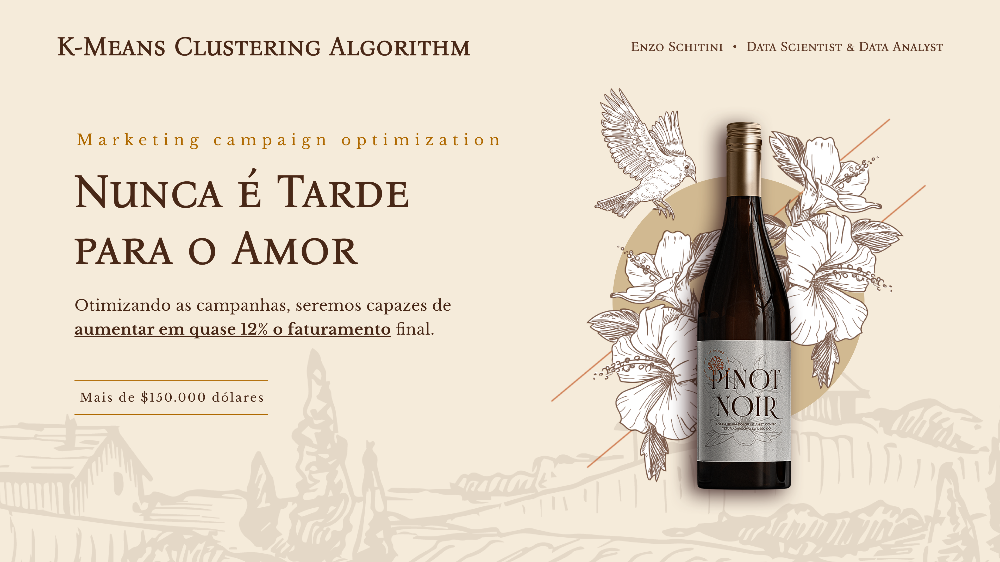

## **"Nunca é Tarde para o Amor"**
### Esse foi o tema estrategicamente escolhido para um post voltado ao público-alvo de um e-commerce. O objetivo é melhorar o direcionamento e a eficácia das ações de marketing, com a expectativa de impulsionar o faturamento em quase **12%**, representando um incremento de mais de **150 mil dólares** na receita final.

### Essas decisões não se baseiam em achismos ou meras suposições. Pelo contrário! Cada detalhe — desde a identificação do público-alvo até o entendimento do que eles desejam e como as campanhas devem ser estruturadas — foi cuidadosamente orientado por uma abordagem **data-driven**, onde os dados são o centro de todas as estratégias.

---

No mercado atual, entender o público-alvo é essencial para criar campanhas de marketing eficazes. Pensando nisso, realizamos uma análise detalhada dos dados de um e-commerce, utilizando o algoritmo de **K-Means** para descobrir padrões, comportamentos e oportunidades ocultas.  

Com base na análise, identificamos que o público-alvo principal está **em busca de um novo relacionamento**. Essa descoberta abriu caminho para entender melhor as necessidades dos clientes e como posicionar campanhas de marketing que não só ressoem emocionalmente, mas também gerem maior retorno financeiro.  

### **Principais Resultados da Análise**  
1. **Segmentação em 4 Grupos de Clientes**  
   Utilizando o K-Means, dividimos os clientes em quatro segmentos distintos, cada um com características únicas em termos de comportamento de compra, aceitação de campanhas e contribuição financeira.  

2. **Identificação dos Clientes Mais Lucrativos**  
   Foi possível determinar quais segmentos trazem o maior retorno financeiro e quais são mais receptivos às campanhas de marketing.  

3. **Insights Estratégicos para Campanhas**  
   Descobrimos como personalizar mensagens e ações para cada segmento, garantindo maior impacto e melhor engajamento com o público-alvo.  

4. **Oportunidades de Crescimento**
   Oportunidades significativas para melhorar o direcionamento e a eficácia das ações de marketing, com **expectativa de aumentar em quase 12% o faturamento final, sendo mais de $150.000 dólares.**

A partir desses perfis, serão criados segmentos distintos, cada um com características específicas que podem ser utilizadas para direcionar mensagens, ofertas e promoções de forma mais eficiente, otimizando o retorno do investimento em marketing e melhorando a experiência do cliente. O objetivo final é desenvolver um sistema de segmentação que permita a personalização da comunicação de marketing e a otimização do direcionamento das campanhas, levando a um aumento das taxas de conversão e fidelização dos clientes.  Além disso, pretendemos identificar oportunidades de novos produtos ou serviços que atendam às necessidades de cada segmento de forma específica.

### Links das fases da análise:
Se você quiser ver a análise completa você pode encontrar as informações nestes links, obviamente você pode continuar lendo este material para ver apenas os resultados da análise

- [1. Exploratory Data Analysis (EDA)](https://github.com/enzoschitini/Data-Science-Portfolio/blob/Marketing-Campaign-Optimization/1.%20Exploratory%20Data%20Analysis%20(EDA).ipynb)
- [2. Descriptive analysis](https://github.com/enzoschitini/Data-Science-Portfolio/blob/Marketing-Campaign-Optimization/2.%20Descriptive%20analysis.ipynb)
- [3. K-Means Clustering Algorithm](https://github.com/enzoschitini/Data-Science-Portfolio/blob/Marketing-Campaign-Optimization/3.%20K-Means%20Clustering%20Algorithm.ipynb)
- [4. Cluster Analysis Insights](https://github.com/enzoschitini/Backup-Folder/blob/CustomerPersonalityAnalysis/4.%20Cluster%20Analysis%20Insights.ipynb)
- [5. Marketing campaign optimization](https://github.com/enzoschitini/Data-Science-Portfolio/blob/Marketing-Campaign-Optimization/5.%20Marketing%20campaign%20optimization.ipynb)

### Importância do Projeto:

Em um mercado cada vez mais competitivo e segmentado, a compreensão profunda do comportamento do cliente é fundamental para o sucesso de qualquer empresa.  A realização de uma análise de personalidade de clientes, como proposta neste projeto, apresenta inúmeras vantagens:

- **Aumento da Eficiência de Marketing:** Ao direcionar as campanhas de marketing para segmentos específicos com necessidades e preferências conhecidas, as empresas podem otimizar o uso de seus recursos, reduzindo desperdícios e aumentando o retorno do investimento (ROI). Mensagens personalizadas são mais eficazes do que abordagens genéricas, gerando maior engajamento e conversões.

- **Melhora na Experiência do Cliente:** Compreender as características e necessidades de cada segmento permite a criação de experiências personalizadas que melhoram a satisfação do cliente. Isso inclui o desenvolvimento de produtos e serviços mais adequados às suas necessidades, bem como a criação de uma comunicação mais relevante e personalizada.

- **Identificação de Oportunidades de Negócio:** A análise pode revelar nichos de mercado inexplorados e oportunidades para o desenvolvimento de novos produtos ou serviços que atendam às necessidades de segmentos específicos.

- **Aumento da Fidelização:** Ao entender as preferências e expectativas de seus clientes, as empresas podem construir relacionamentos mais fortes e duradouros, aumentando a fidelidade e a lealdade dos clientes.

- **Tomada de Decisões Estratégicas:** As informações geradas pela análise de personalidade do cliente proporcionam dados concretos para a tomada de decisões mais embasadas e estratégicas, tanto no âmbito de marketing quanto em outras áreas da empresa.

- **Competitividade:** No mercado atual, empresas com uma compreensão profunda do seu público conseguem se diferenciar da concorrência e obter uma vantagem competitiva significativa.

### Metodologia

A metodologia a ser utilizada envolve diversas etapas: limpeza e pré-processamento dos dados, análise descritiva, exploração de variáveis, aplicação de técnicas de clustering como o K-Means para a formação de segmentos,  análise da significância estatística dos segmentos encontrados e, por fim, a interpretação dos resultados e geração de recomendações para a empresa.

## Enzo Schitini
### Data Scientist & Data Analyst • Senior Bubble Developer • SQL • Ux/Ui Design

 

# Existe mesmo uma única maneira de abordar a todos os clientes?

### A segmentação de clientes é uma das etapas mais importantes para o sucesso das campanhas de marketing. No entanto, muitas empresas enfrentam grandes desafios nessa área:  

###

- **Dificuldade em entender o público-alvo**: Muitas campanhas são generalizadas, ignorando as diferenças entre os clientes e suas necessidades específicas.  
- **Perda de tempo e dinheiro**: Investimentos significativos são feitos para identificar o público-alvo, mas muitas vezes os resultados mostram que os esforços foram direcionados às pessoas erradas.  
- **Falta de clareza na comunicação**: Sem uma segmentação clara, é difícil criar mensagens que ressoem com o público-alvo, resultando em campanhas menos eficazes.  
- **Estratégias equivocadas**: Campanhas baseadas em suposições ou dados incompletos frequentemente resultam em desperdício de recursos e resultados abaixo do esperado.  

### Essa realidade nos leva a um questionamento: 
> ## *Como transformar dados em uma estratégia sólida de segmentação que realmente impulsione o retorno sobre investimento?*

# **Segmentação Inteligente: Uma Solução para Otimizar Campanhas de Marketing**  

## Descrição do problema de negócio:

Durante uma análise dos dados de um e-commerce, identifiquei um problema comum que pode estar impactando diretamente seus resultados: a falta de uma segmentação clara de clientes. Apesar das campanhas realizadas, os dados sugerem que há oportunidades significativas para melhorar o direcionamento e a eficácia das ações de marketing.

---

### O objetivo? 
### **Otimizar as campanhas de marketing, garantindo que os esforços sejam direcionados aos clientes certos, com as mensagens certas.**

---

Utilizando o algoritmo de **K-Means**, identifiquei quatro grupos distintos de clientes. Cada um desses clusters revela padrões importantes sobre comportamentos, preferências e contribuições financeiras ao negócio. 

Essa segmentação fornece insights valiosos para:  

- **Aumentar a eficiência das campanhas**: Investindo recursos em grupos de maior potencial de retorno.  
- **Personalizar mensagens**: Criando comunicações específicas que ressoam com cada segmento.  
- **Maximizar o ROI (Retorno sobre Investimento)**: Evitando gastos desnecessários em campanhas genéricas e pouco eficazes.  

### **O que isso significa para o negócio?**  
Em um cenário competitivo como o e-commerce, a capacidade de entender e atender os clientes de forma segmentada não é apenas um diferencial, mas uma necessidade para:  

- **Reduzir desperdícios em marketing**.  
- **Aumentar a retenção e a fidelidade dos clientes mais valiosos**.  
- **Identificar oportunidades inexploradas** em grupos de clientes com alto potencial.  

Nos próximos passos, apresentarei os detalhes da análise e como ela pode ser utilizada para transformar dados em decisões estratégicas e resultados concretos.  

# **Contexto dos dados**

O conjunto de dados analisado reflete as interações e características dos clientes de uma loja que opera tanto em um ambiente físico quanto digital, incluindo website e catálogo. Ele captura informações detalhadas, como idade, renda, composição familiar, histórico de compras e participação em campanhas, fornecendo uma visão ampla do comportamento do consumidor. Esse contexto é particularmente relevante para uma loja que busca entender melhor seus clientes e otimizar estratégias de marketing, segmentando campanhas e priorizando ações que aumentem a retenção e o retorno sobre o investimento.

Além de identificar características demográficas e padrões de comportamento, o conjunto de dados oferece insights valiosos sobre as preferências de compra e a lealdade dos clientes, como o valor gasto em diferentes categorias de produtos, frequência de compras e canais preferidos. 

Essa riqueza de informações é essencial para entender quais grupos de clientes geram maior retorno financeiro e como direcionar campanhas personalizadas para maximizar a eficiência e o impacto das ações de marketing, alinhando estratégias com o objetivo principal de aumentar a lucratividade e fidelização.

## Distribuição do Nível Educacional

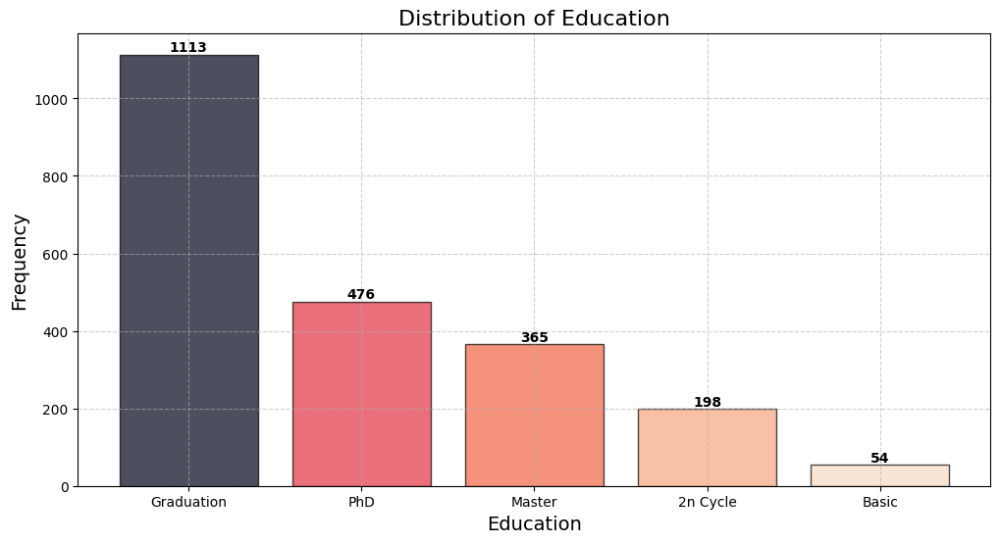

O gráfico da distribuição da educação mostra que a maioria dos clientes possui graduação (1113), seguida por doutorado (476), enquanto níveis básicos de educação são os menos representados. Isso indica que o público-alvo é composto majoritariamente por pessoas com alto nível de qualificação.

## Distribuição do Volume Total de Compras

A análise do número de vendas revela que a maioria dos clientes realiza entre 5 e 15 compras, com uma redução significativa após esse intervalo. Isso sugere a necessidade de estratégias de fidelização para aumentar o volume de compras dos clientes.

## Distribuição Etária dos Clientes

O gráfico da idade demonstra uma concentração equilibrada de clientes entre 30 e 60 anos, com picos em torno dos 40. Isso indica que o público principal é composto por adultos em meia-idade, o que pode orientar estratégias específicas de marketing.

## Distribuição do Estado Civil dos Clientes

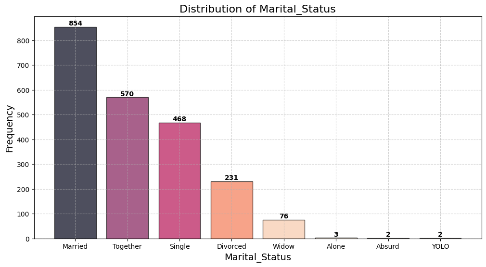

O gráfico do estado civil mostra que a maioria dos clientes é casada (854) ou vive junto (579), enquanto categorias como viúvos, sozinhos ou com status "YOLO" são pouco representadas. Isso pode influenciar nas estratégias de marketing ao considerar a situação familiar dos clientes.

## Distribuição das Faixas de Renda

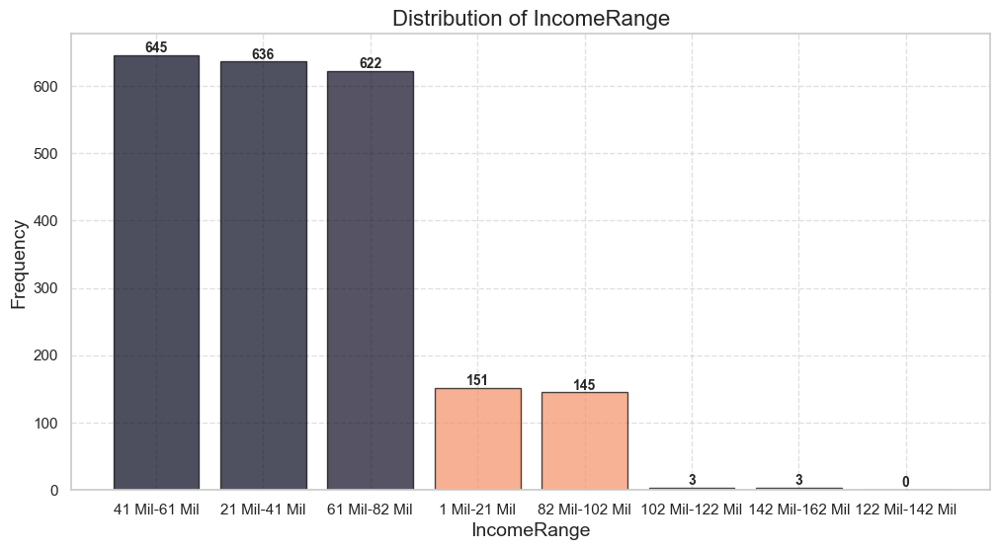

A distribuição da renda indica que a maioria dos clientes se encontra nas faixas entre 41 e 80 mil, enquanto rendas abaixo de 20 mil ou acima de 120 mil são raras. Isso aponta para um público-alvo com poder aquisitivo médio a alto, que pode direcionar campanhas e ofertas.

## Análise da venda por tipo de produto

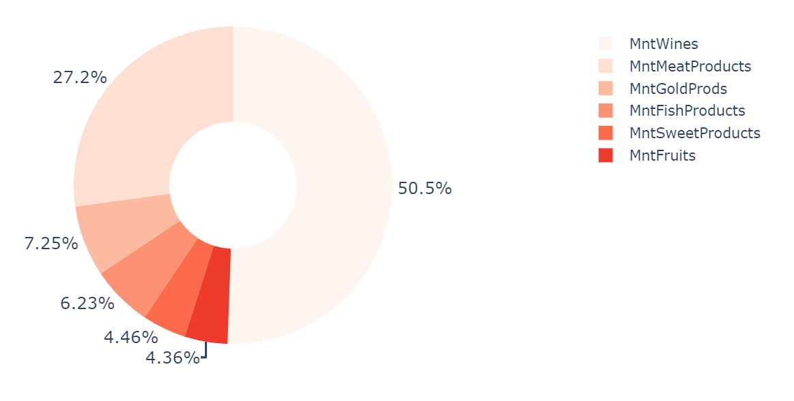

Vinhos correspondem a mais da metade das vendas (50,5%), seguidos por carnes (27,2%), enquanto doces, frutas, peixes e produtos de ouro têm participações menores, sugerindo diferenciação nas preferências dos clientes.

## Análise da aceitação por campanha

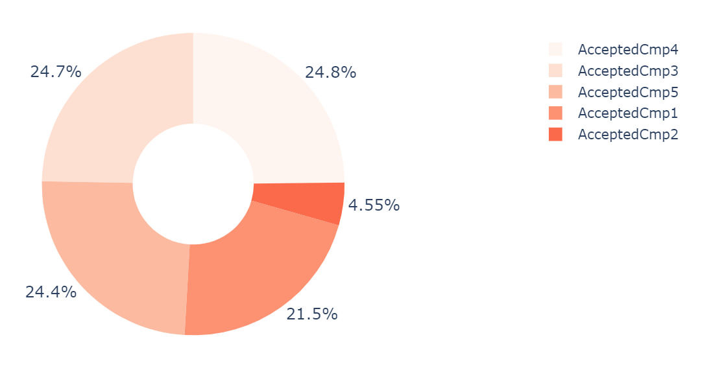

As campanhas 3, 4 e 5 tiveram aceitação semelhante (cerca de 24%), enquanto as campanhas 1 e 2 apresentaram menor adesão, destacando oportunidades para melhorias estratégicas. 

## Análise do local da venda

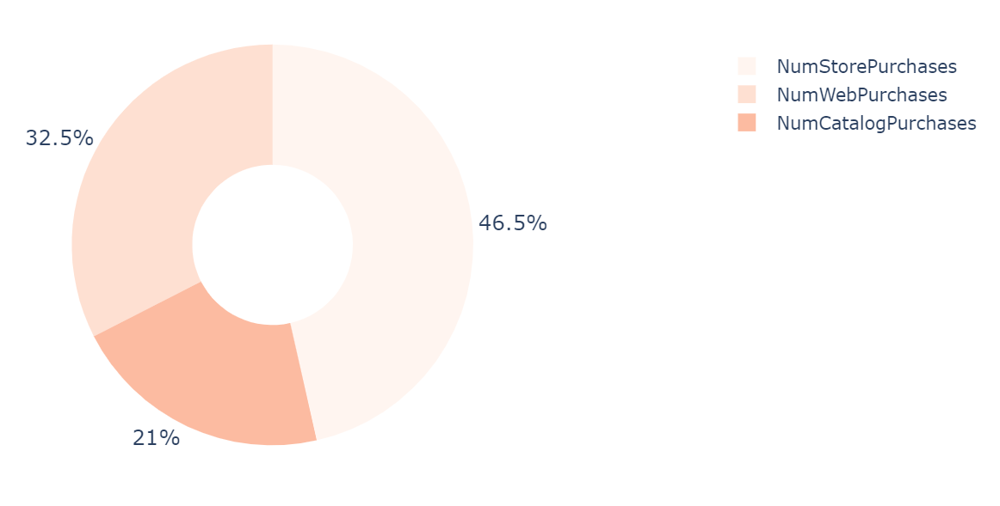

As lojas físicas são o canal predominante (46,5%), seguidas por compras online (32,5%) e por catálogo (21%), apontando a relevância de estratégias omnichannel para otimizar a experiência do cliente.

# **Perfil médio dos clientes**

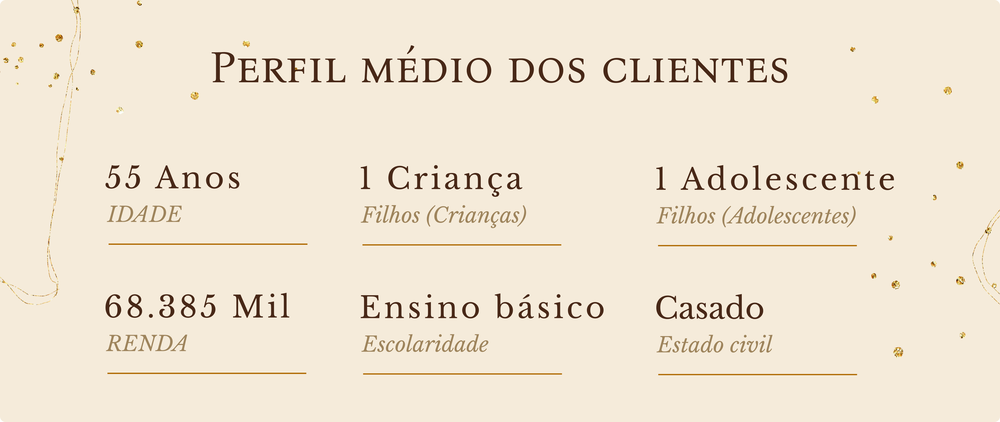

# **Podemos Confiar em Representações Gerais?**  

No mundo dos negócios, é comum que empresas criem estratégias de marketing baseadas em um **perfil médio de cliente**. Mas será que essa abordagem realmente funciona? A resposta, na maioria das vezes, é **não**.  

### **O problema com as médias**  
Ao estabelecer um único perfil genérico para todos os clientes:  
- **Perdemos a diversidade do público-alvo**: Cada cliente tem comportamentos, necessidades e expectativas únicas que não são capturadas em uma média.  
- **Corremos o risco de tomar decisões erradas**: Estratégias baseadas em generalizações tendem a não ressoar com a realidade de nenhum cliente específico.  
- **Comprometemos a eficácia das campanhas**: Investir em ações que tentam agradar a todos pode significar não agradar ninguém.  

### **A ilusão da representatividade**  
Representações gerais não apenas simplificam excessivamente a realidade, mas também ignoram os **clusters naturais** que existem entre os clientes. No final, a “média” pode acabar sendo um cliente que, na prática, **não existe**.  

# **O que fazer para superar esse desafio?** 
### *Algoritmo de agrupamento K-Means*
É aqui que entra a **análise orientada por dados**. Com o uso de técnicas como o algoritmo de **K-Means**, podemos identificar grupos distintos de clientes que realmente existem e entender:  
- Quem são os clientes mais valiosos.  
- Como suas necessidades e comportamentos variam.  
- Quais mensagens e campanhas têm maior probabilidade de sucesso para cada grupo.  

Nas próximas seções, apresentarei como uma análise baseada em dados pode substituir generalizações perigosas por insights precisos e orientados a resultados. Afinal, confiar cegamente em representações gerais não é uma estratégia — é um risco que as empresas não podem mais se dar ao luxo de correr.  

# Apresentação dos Clusters

### **Cluster 0**
Este grupo consiste em consumidores com renda média alta, geralmente acima dos 45 anos, que investem significativamente em produtos de luxo e bebidas alcoólicas. São casados ou em relacionamentos, com famílias pequenas ou sem filhos. O comportamento de compra reflete um estilo de vida sofist\icado, com alta aceitação em campanhas de marketing.

- **Idade média**: 45,9 anos (máximo: 62 anos).  
- **Renda média**: R$71.054 (variação: R$46.015 - R$102.692).  
- **Gastos principais**: Vinhos (R$898), carnes (R$250), produtos de luxo (R$66).  
- **Gasto total médio**: R$1.307 por ano.  
- **Participação em campanhas**: Alta, com grande aceitação em todas as campanhas.  
- **Tamanho familiar**: Pequeno (média de 1,3 pessoas).
- **Estado civil**:  
   - Tem forte presença na categoria **Junto(a)**, indicando que muitos clientes desse cluster estão em relacionamentos (uniões estáveis, mas não formalmente casados).  
   - Também apresenta uma participação notável em **Casado(a)** e **Solteiro(a)**, mas menor em outras categorias como **Divorciado(a)** e **Viúvo(a)**.  
   - Pode representar pessoas em relacionamentos, mas não exclusivamente casadas, talvez em uma fase de vida de estabilidade conjugal.
---

### **Cluster 1**
Este cluster é composto por consumidores de meia idade com renda média moderada. São levemente propensos a gastar em vinhos e carnes, mas seus gastos gerais são mais conservadores. Embora geralmente casados, suas famílias são pequenas ou inexistentes.

- **Idade média**: 49,3 anos (máximo: 73 anos).  
- **Renda média**: R$57.148 (variação: R$4.428 - R$157.733).  
- **Gastos principais**: Vinhos (R$422), carnes (R$175), frutas (R$28).  
- **Gasto total médio**: R$753 por ano.  
- **Participação em campanhas**: Moderada, com taxas de resposta em torno de 22%.  
- **Tamanho familiar**: Pequeno (média de 1,9 pessoas).
- **Estado civil**:  
   - Este cluster parece mais equilibrado, com proporções relativamente distribuídas entre **Casado(a)**, **Junto(a)** e **Solteiro(a)**, mas sem grandes picos em nenhuma categoria específica.  
   - Mostra proporções baixas nas categorias como **Viúvo(a)**, o que pode indicar que o cluster inclui pessoas com status civil mais convencionais.  
   - Pode representar um perfil mais diversificado em termos de estado civil.

---

### **Cluster 2**
Predominantemente jovens adultos, este cluster tem a menor renda média e um perfil de consumo básico. A maioria dos gastos é concentrada em carne, vinhos e itens essenciais. Eles tendem a responder menos às campanhas, provavelmente devido às restrições financeiras.

- **Idade média**: 35,4 anos (máximo: 63 anos).  
- **Renda média**: R$42.541 (variação: R$1.730 - R$105.471).  
- **Gastos principais**: Carne (R$155), vinhos (R$205), peixe (R$32).  
- **Gasto total médio**: R$474 por ano.  
- **Participação em campanhas**: Moderada, com resposta de 18%.  
- **Tamanho familiar**: Pequeno (média de 1,3 pessoas).
- **Estado civil**:  
   - Este cluster se destaca fortemente na categoria **Casado(a)**, mostrando que a maioria das pessoas nele está formalmente casada.  
   - Possui proporções significativamente menores nas categorias **Solteiro(a)**, **Junto(a)** e quase inexistentes nas categorias **Viúvo(a)**.
   - Pode ser caracterizado como um cluster de pessoas em relacionamentos formais e estáveis.

---

### **Cluster 3**
Um grupo diversificado em termos de idade e renda, com comportamento de compra balanceado. Seus gastos incluem itens de maior valor como vinhos e carnes, mas também compras de itens diversificados. Eles têm uma resposta média às campanhas.

- **Idade média**: 51,2 anos (máximo: 74 anos).  
- **Renda média**: R$56.332 (variação: R$5.648 - R$162.397).  
- **Gastos principais**: Vinhos (R$309), carnes (R$163), frutas (R$28).  
- **Gasto total médio**: R$613 por ano.  
- **Participação em campanhas**: Moderada, com resposta de 6%.  
- **Tamanho familiar**: Pequeno (média de 1,9 pessoas).
- **Estado civil**:  
   - Apresenta maior proporção em **Solteiro(a)**, indicando que muitos clientes neste cluster estão solteiros.  
   - Tem menor presença em categorias como **Casado(a)** e **Junto(a)** e proporções muito pequenas em **Viúvo(a)**.  
   - Representa um perfil de pessoas solteiras, possivelmente em uma fase de vida mais independente.

---

# Análise descritiva de clusters

A análise descritiva de clusters é uma abordagem essencial para compreender as características e comportamentos de diferentes grupos identificados em um conjunto de dados. Por meio de técnicas como o K-Means, é possível segmentar clientes ou itens em clusters com base em suas similaridades, permitindo identificar padrões, traçar perfis e explorar as particularidades de cada grupo.

## Quantidade de indivíduos de cada Cluster

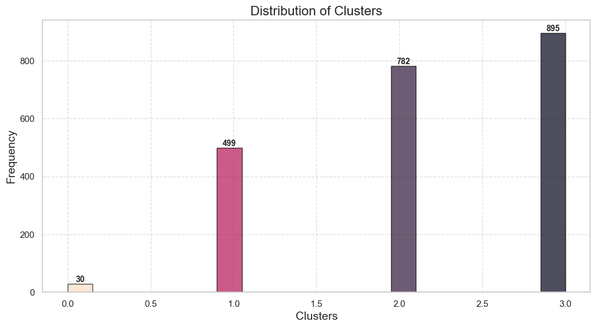

## Análise temporal do número de indivíduos para cada Cluster

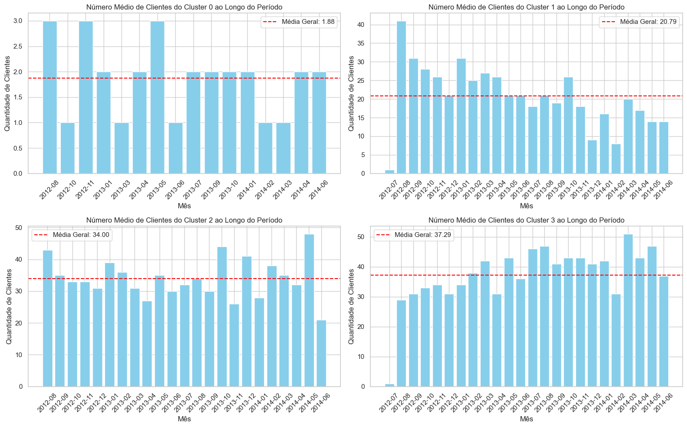

Os gráficos mostram que o Cluster 1 apresenta uma diminuição consistente no número médio de clientes ao longo do tempo, indicando que esse grupo está perdendo interesse ou migrando para outros clusters. 

Por outro lado, o Cluster 2 apresenta um aumento gradual, sugerindo maior engajamento ou a adaptação de estratégias que atraíram clientes com esse perfil. 

Essa dinâmica pode refletir uma migração de clientes do Cluster 1 para o Cluster 2, possivelmente devido a mudanças no comportamento de compra ou ao impacto de campanhas mais alinhadas com as características do Cluster 2, o que pode ser positivo para o negócio se esse grupo tiver maior potencial de retorno.

## Comparação dos Clusters em variáveis numéricas - (Gráfico de Radar)

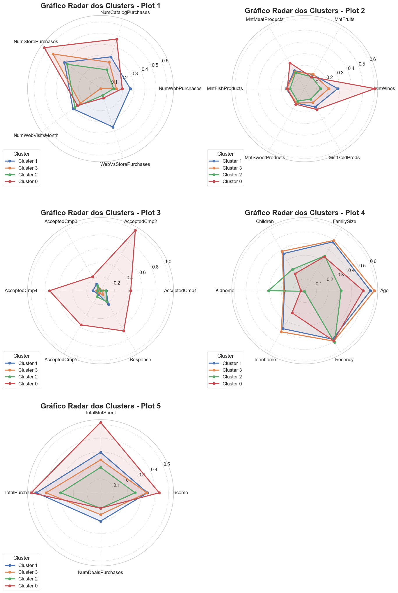

## Comparação dos Clusters em variáveis categóricas - (Gráfico de Radar)

# Desenpenho dos Clusters

## Quais Clusters trazem mais retornos? E quais trazem menos retorno?

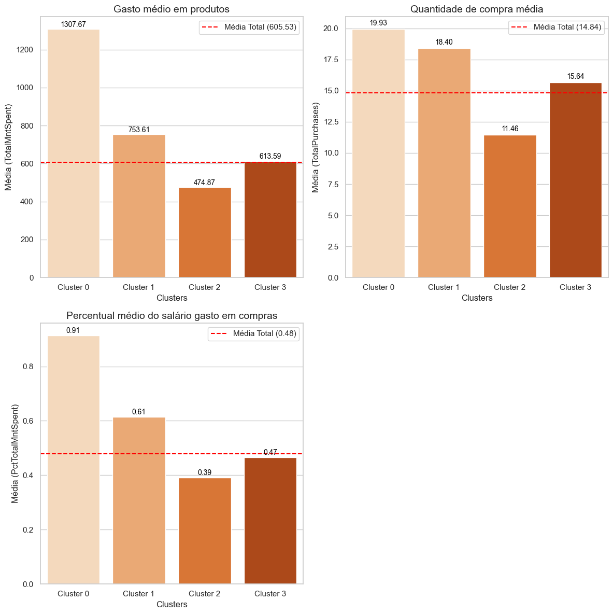

Com base nos gráficos apresentados, o Cluster 0 é o que traz mais retorno, destacando-se pelo maior gasto médio em produtos (1307,67) e pela maior quantidade de compras médias (19,93), além de destinar o maior percentual do salário para compras (0,91). 

Por outro lado, o Cluster 2 é o que traz menos retorno, apresentando os menores valores em todas as métricas: gasto médio em produtos (474,87), quantidade de compras médias (11,46) e percentual do salário gasto (0,39). 

Isso evidencia que o Cluster 0 possui clientes com maior potencial financeiro e engajamento, enquanto o Cluster 2 requer estratégias mais robustas para aumentar sua contribuição.

## Comparação demográfica entre os Clusters

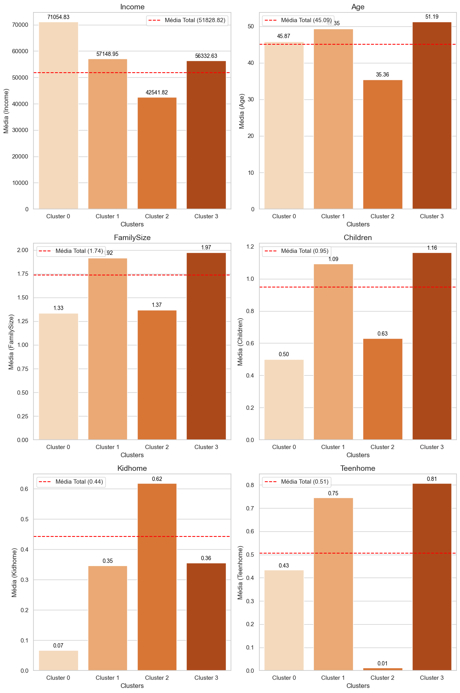

Os gráficos destacam as características demográficas dos clusters identificados no e-commerce, revelando importantes distinções. 

O Cluster 0 possui a menor renda mediana, enquanto o Cluster 3 se destaca como o grupo com maior renda e idade média mais alta. Em termos de tamanho familiar e número de filhos, o Cluster 3 também apresenta os maiores valores médios, indicando um perfil mais robusto em termos de família. 

Já o Cluster 2 possui a maior proporção de crianças em casa, enquanto o Cluster 1 lidera em adolescentes. Essas diferenças são fundamentais para direcionar estratégias de marketing personalizadas e identificar o cluster com maior potencial de retorno financeiro.

## Intervalo de valores para cada Cluster - (Referente às variáveis ​​demográficas)

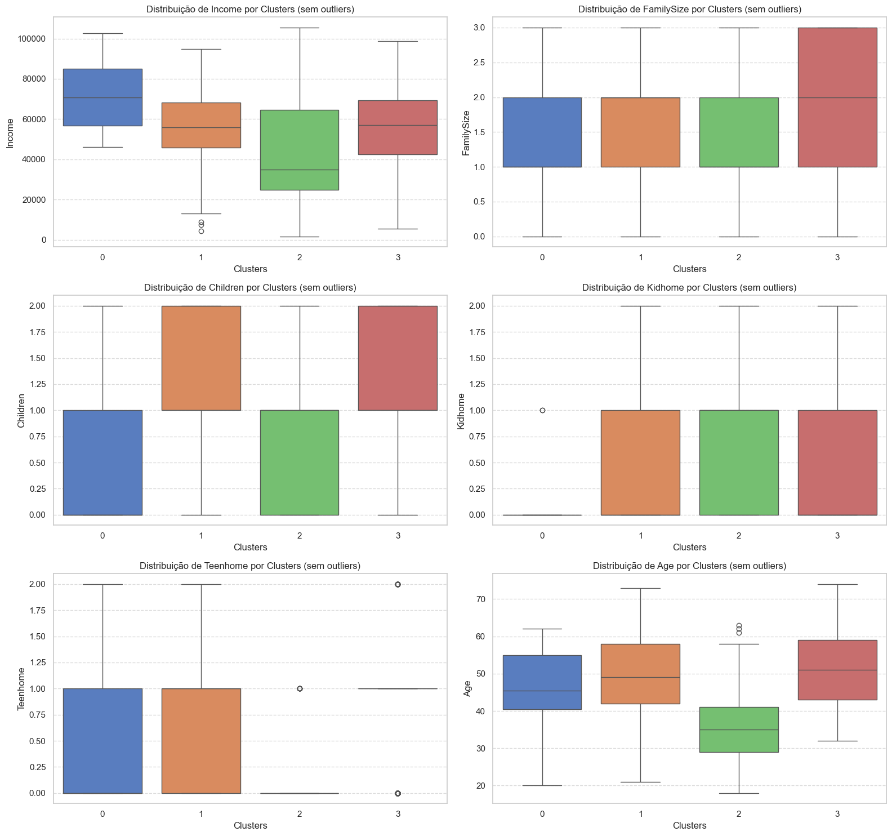

## Onde mais compra cada Cluster

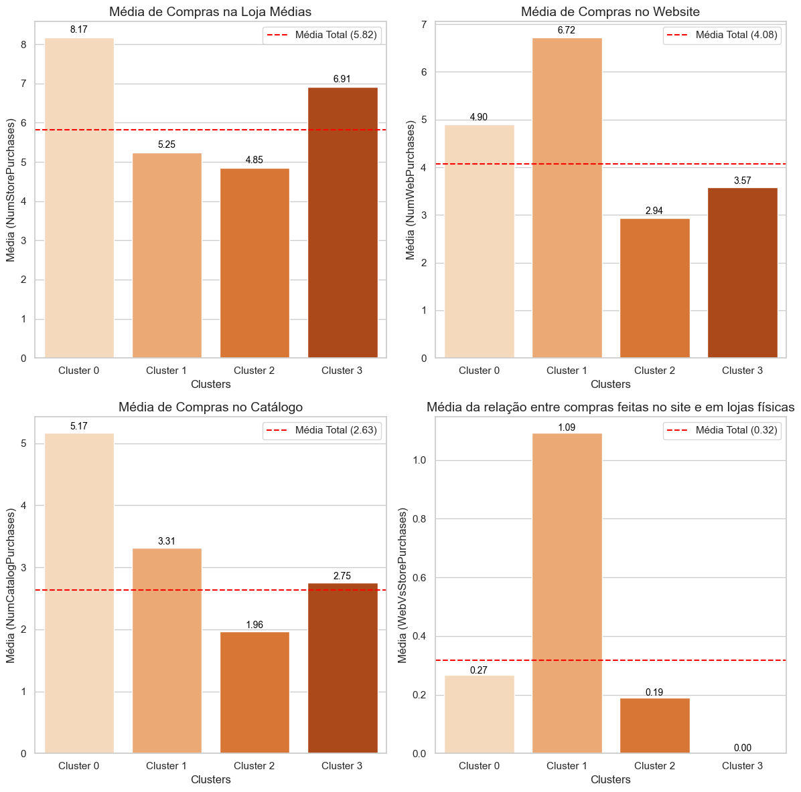

Os gráficos mostram diferenças significativas no comportamento de compra dos clusters. O Cluster 0 se destaca pela maior média de compras em lojas físicas (8,17) e no catálogo (5,17), indicando uma preferência por interações mais tradicionais. 

O Cluster 1 lidera nas compras online (6,72), evidenciando um perfil mais digital e inclinado a usar o website para transações. 

Já o Cluster 3 apresenta um equilíbrio, com alta média de compras tanto em lojas físicas (6,91) quanto no catálogo (2,75), enquanto o Cluster 2 tem os menores valores em todas as métricas, mostrando menor engajamento em qualquer canal. 

Essas diferenças indicam que cada cluster possui comportamentos distintos que podem ser explorados com campanhas personalizadas baseadas nos canais de preferência de cada grupo.

## Preferencia de Produtos na Compra por Cluster

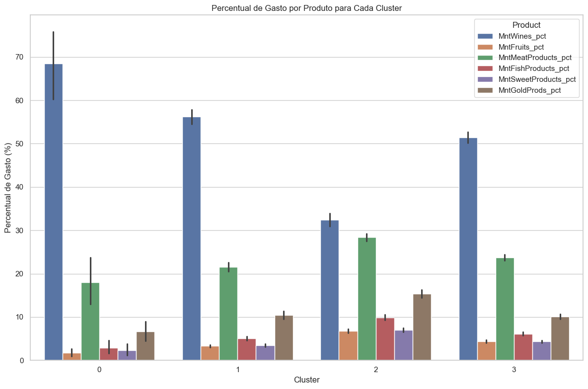

A análise das preferências de produtos por cluster revela diferenças significativas nos hábitos de consumo. 

O Cluster 0 apresenta um percentual de gasto extremamente alto em vinhos, enquanto outros produtos têm participação mínima. 

Nos Clusters 1, 2 e 3, há uma distribuição mais equilibrada, com destaque para carnes, seguidas por vinhos e produtos de luxo, como itens de ouro, variando em menor proporção. 

Essa segmentação ajuda a entender quais categorias de produtos são prioritárias para cada grupo, permitindo a criação de campanhas focadas em maximizar o engajamento e retorno financeiro.

# **Intervenção e Hipótese**  
### **Redirecionando esforços para maximizar resultados**  

A análise dos dados revelou a existência de **quatro clusters** ou perfis distintos de clientes. Entre eles, o **Cluster 2** se destacou negativamente:  
- **Menor retorno financeiro**: Esses clientes contribuem significativamente menos para o faturamento do e-commerce em comparação com os demais clusters.  
- **Baixa receptividade às campanhas**: As ações de marketing direcionadas a esse grupo geram resultados pouco expressivos, indicando um baixo engajamento e conversão.  

Apesar disso, as campanhas atuais também estão sendo direcionadas para esses clientes, consumindo recursos que poderiam ser mais bem aplicados.  

### **O que fazer a partir disso?**  

1. **Reavaliar a alocação de recursos**  
   - Direcionar menos investimentos ao Cluster 2 pode liberar orçamento para focar nos clusters mais lucrativos.  
   - Ao reduzir esforços em um segmento pouco rentável, a empresa evita desperdícios e melhora o ROI global.  

2. **Focar nos clusters mais promissores**  
   - Os dados mostram que os outros clusters apresentam maior potencial de retorno e aceitam melhor as campanhas de marketing.  
   - Investir em estratégias personalizadas para esses grupos pode maximizar o impacto das ações, aumentando o faturamento.  

3. **Testar a hipótese da eliminação gradual**  
   - Uma estratégia interessante seria **eliminar gradualmente o foco no Cluster 2**, enquanto se monitora o impacto no faturamento total.  
   - Caso a redução de esforços nesse grupo não impacte negativamente os resultados, a hipótese estará validada.  

4. **Aumentar o foco em personalização**  
   - Desenvolver campanhas específicas para cada um dos outros clusters pode não apenas aumentar as vendas, mas também melhorar a percepção da marca e a fidelidade dos clientes.  

### **Oportunidade de Crescimento**  
Eliminando o Cluster 2 e realocando recursos para os clusters mais valiosos, a empresa tem a oportunidade de:  
- **Aumentar o faturamento total**, aproveitando melhor os clientes de maior potencial.  
- **Reduzir custos em campanhas com baixo impacto.**  
- **Criar estratégias mais assertivas**, fortalecendo a conexão com o público que realmente traz resultados.  

# Apresentação de Resultados da Análise com K-Means

## Expectativas de Retorno

Imagine poder alavancar o faturamento do e-commerce em quase 12%, simplesmente ajustando a direção das campanhas de marketing e otimizando os investimentos em clientes de maior potencial. Esse é o objetivo principal desta análise, realizada com base no algoritmo de K-Means, que identificou quatro clusters distintos entre os clientes. 

### Vamos explorar os cenários mais relevantes para mostrar o impacto das decisões estratégicas nos resultados.

## 1. Cenário Principal: Exclusão do Cluster 2

O Cluster 2 representa um perfil de clientes que, historicamente, apresenta baixo retorno financeiro para o e-commerce. Ao direcionarmos as campanhas para os demais clusters e eliminarmos esse grupo, o potencial de aumento no faturamento é significativo. Veja os detalhes:

- ### **Faturamento Total Real:** \$1,335,799.00
- ### **Faturamento Simulado (sem Cluster 2):** \$1,494,076.79
- ### **Aumento Absoluto:** \$158,277.79
- ### **Crescimento Percentual:** +11.85%
- ### **Intervalo de Confiança (95%):** \$1,441,634.17 - \$1,545,433.80

###

Essa estratégia oferece um balanço ideal entre simplicidade e retorno, permitindo um aumento de quase 12% no faturamento total, o que equivale a aproximadamente **\$150,000.00 dólares**.

## 2. Cenário Alternativo: Foco Exclusivo nos Clusters 0 e 1

Outra abordagem seria concentrar os esforços nos clientes com maior potencial de retorno, representados pelos Clusters 0 e 1. Apesar do impacto positivo ser ainda maior, essa estratégia exige um investimento mais seletivo e pode excluir grupos relevantes:

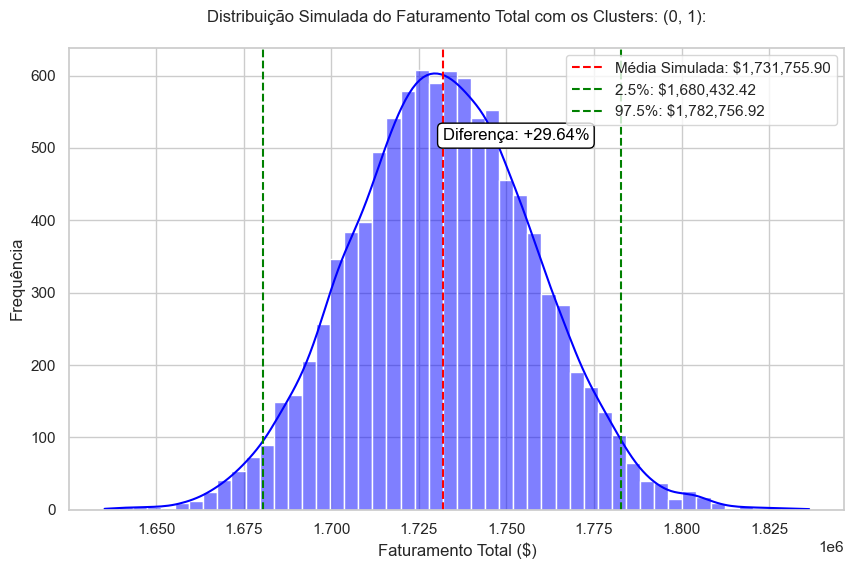

- ### **Faturamento Total Real:** \$1,335,799.00
- ### **Faturamento Simulado (apenas Clusters 0 e 1):** \$1,731,484.91
- ### **Aumento Absoluto:** \$395,685.91
- ### **Crescimento Percentual:** +29.62%
- ### **Intervalo de Confiança (95%):** \$1,680,730.00 - \$1,782,819.21

###

Embora essa alternativa sugira um aumento de quase 30% no faturamento, é importante avaliar a capacidade operacional de atender exclusivamente a esses clusters.

## 3. Impacto da Perda de Clientes de Alto Retorno

É essencial considerar também os riscos de perder clientes estratégicos. Abaixo, destacamos os impactos potenciais:

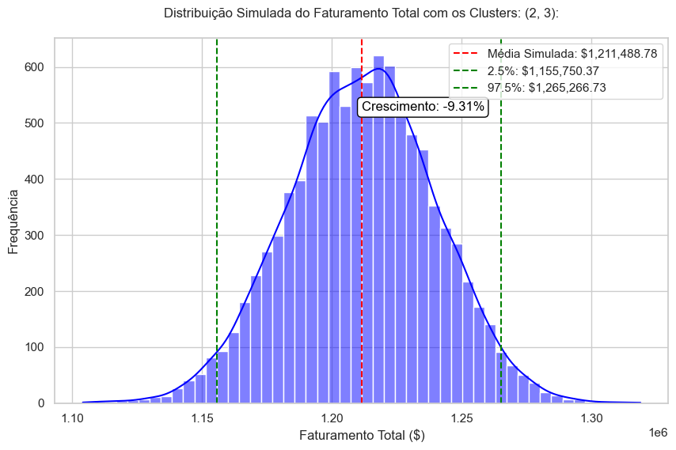

- ### **Perda do Cluster 0:** Queda de \$20,919.24 (-1.57%)
- ### **Perda do Cluster 1:** Queda de \$95,624.68 (-7.16%)
- ### **Perda Combinada dos Clusters 0 e 1:** Queda de \$125,027.02 (-9.36%)

### 

Esses cenários reforçam a importância de proteger os clientes de maior valor enquanto otimizamos os investimentos em outros grupos.

###

O algoritmo de K-Means nos proporcionou uma visão detalhada dos perfis de clientes e suas respectivas contribuições financeiras. A análise indica que o **cenário principal**, com a exclusão do Cluster 2, é a estratégia mais eficaz para aumentar o faturamento. Essa abordagem combina simplicidade e impacto, garantindo um crescimento significativo e sustentável.

# Que tipos de clientes as campanhas de marketing devem analisar?

## **Perfis de Clientes e Impacto nos Resultados da Plataforma**  

### **1. Perfil público-alvo**  
Os clientes mais valiosos para a plataforma possuem características que demonstram maior estabilidade financeira, educação avançada e hábitos familiares que favorecem o consumo consistente. Veja os detalhes:  

- **Faixa etária:** A partir dos 40 anos, com desempenho ideal entre 40 e 58 anos. Essa faixa reflete uma fase de maior estabilidade de vida, tanto financeira quanto pessoal.  
- **Renda:** Entre $42.000 e $80.000 anuais. Este grupo tem poder de compra significativo, garantindo um ticket médio elevado.  
- **Configuração familiar:**  
  - Melhor desempenho observado em famílias com dois filhos.  
  - Pelo menos um filho adolescente. 
  - Preferencialmente sem filhos em idade infantil, possivelmente por uma mudança de prioridades no consumo.  
- **Escolaridade:** Profissionais com Mestrado ou PhD, indicando maior qualificação.  
- **Estado civil:** Tendem a estar em relacionamentos casuais, divorciados ou viúvos. Esses estados civis podem representar maior autonomia financeira e decisão de compra.  

### **2. Perfis de clientes a evitar**  
Por outro lado, os clientes com menor retorno possuem características que limitam seu poder de compra e impacto na plataforma:  

- **Faixa etária:** Abaixo dos 40 anos, faixa marcada por instabilidade financeira e prioridades menos alinhadas ao consumo constante.  
- **Renda:** Inferior a $42.000 anuais, refletindo um poder aquisitivo mais restrito.  
- **Configuração familiar:**  
  - Famílias com apenas um filho, geralmente crianças.  
  - A ausência de filhos adolescentes pode estar relacionada a uma menor necessidade ou interesse em certos produtos ou serviços.  
- **Escolaridade:** Ensino básico ou médio, indicando menor capacidade de investimento em produtos de maior valor agregado.  
- **Estado civil:** Predominantemente solteiros ou casados. Solteiros podem priorizar outros tipos de consumo, enquanto casados podem estar mais focados em gastos essenciais.  

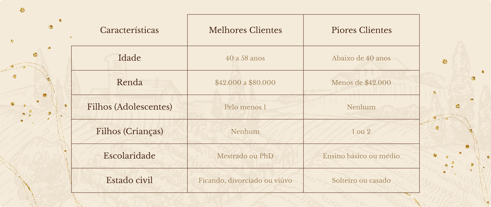

### **Observações Finais**  
Os melhores clientes apresentam um perfil mais maduro e economicamente estável, o que resulta em maior retorno financeiro e fidelidade à plataforma. Já os piores clientes, embora representem uma parte importante da base de usuários, possuem características que limitam sua contribuição direta aos resultados da plataforma.  

Essa análise reforça a necessidade de campanhas segmentadas, priorizando o perfil dos melhores clientes e adaptando estratégias para atrair novos usuários com características semelhantes.

# Como deveriam ser essas campanhas? - Conexão emocional com o público-alvo

Com base na análise do perfil dos melhores clientes, identificamos características que sugerem um público composto por pessoas 
que já vivenciaram relacionamentos, possivelmente passaram por mudanças em sua vida conjugal, e que agora podem estar abertas a novas experiências 
e conexões. As caracteristicas desse grupo nos leva a recomendar uma estratégia 
de associação de produtos, como vinhos, a mensagens que promovam o amor e a celebração da vida.

Essa abordagem reforça a conexão emocional 
com os clientes, alinhando o posicionamento da marca ao estilo de vida e aos valores desse público, e destacando os vinhos como símbolos de 
momentos de alegria e união.

### **Campanha Publicitária: "Nunca é Tarde para o Amor"**  

#### **Conceito Principal**  
A campanha deve destacar a mensagem de que o amor, a celebração da vida, conectando isso ao estilo de vida dos melhores clientes. Essa narrativa associa os produtos da plataforma a momentos especiais e prazerosos.  

#### **Slogan Refinado**  
- "Para o amor, o tempo é apenas um detalhe."  
- "Celebre o amor, o sabor e a vida em qualquer idade."  

#### **Visual da Publicidade**  
**Cenário:**  
- Um jantar elegante em um ambiente acolhedor, sofisticado, com iluminação quente (velas ou uma luz dourada suave).  
- Mesa decorada com uma garrafa de vinho de destaque, taças cristalinas, pratos refinados e uma composição de carnes.  

**Personagens:**  
- Um casal na faixa dos 40 a 58 anos, representando diferentes perfis do público-alvo.  
- Ambos bem vestidos: ela com joias de ouro discretas e elegantes (brincos ou colar); ele com um relógio clássico ou um anel de ouro.  

#### **Mensagem da Publicidade**  
- Texto principal:  
  "Nunca é tarde para brindar aos momentos que realmente importam. Experimente o sabor da vida com quem faz seu coração bater mais forte."  
- Chamada para ação:  
  "Descubra nossos vinhos e crie momentos inesquecíveis." 

# Estratégias de Marketing Complementares

## **1. Vendas Cruzadas (Cross-Selling):**  
Aproveite o momento de compra de vinhos para sugerir produtos complementares diretamente relacionados.  

- **Exemplo na Plataforma:**  
  - Ao selecionar um vinho premium, sugerir cortes nobres de carne que harmonizem perfeitamente com a bebida, como "Filé Mignon" ou "Picanha Angus".  
  - Inserir na página do vinho uma seção com joias discretas, como anéis ou brincos de ouro, com a mensagem: *"Complete a ocasião com um toque de elegância."*  

- **Texto Promocional:**  
  "Escolha o vinho ideal e descubra as combinações perfeitas para transformar seu jantar em uma experiência inesquecível."  

---

## **2. Vendas Complementares (Upselling):**  
Incentive os clientes a optarem por versões mais sofisticadas ou pacotes exclusivos que agreguem mais valor.  

- **Exemplo na Plataforma:**  
  - Sugestão de vinhos de safras especiais ou edições limitadas com descrições que destacam sua exclusividade e sabor superior.  
  - Para carnes, oferecer cortes maturados ou pacotes que incluam temperos gourmet como complemento.  

- **Texto Promocional:**  
  "Eleve seu jantar a um nível superior com rótulos exclusivos e cortes premium especialmente selecionados."  

---

## **3. Bundle (Agrupamento de Produtos):**  
Crie pacotes promocionais que incluam vinhos, carnes e joias, oferecendo um preço atrativo.  

- **Exemplo de Kit Promocional:**  
  - **Kit "Jantar Romântico Premium":**  
    - 1 garrafa de vinho premium.  
    - 1 corte nobre de carne.  
    - 1 peça de joia em ouro (anel ou brinco).  
  - **Preço Promocional:** Inclua uma mensagem clara sobre a economia, como "Economize 20% com este kit exclusivo."  

- **Texto Promocional:**  
  "Tudo o que você precisa para um momento inesquecível em um só lugar. Escolha o Kit Jantar Romântico Premium."   

# Podemos ir mais longe?

### **Roteiro para o Vídeo: "Nunca é Tarde para Encontrar o Verdadeiro Amor"**

#### **Cena 1: O Encontro e o Início do Amor**  
- **Local:** Faculdade, anos atrás.  
- **Ação:** O vídeo começa com uma cena suave de dois jovens se conhecendo na faculdade, trocando olhares durante uma aula. Eles parecem inseparáveis, caminhando juntos pelos corredores, se formando e criando uma vida juntos.  
- **Trilha sonora:** Música suave e romântica, transmitindo a ideia de um amor jovem e promissor.  

**Texto na tela:**  
_"O amor pode começar de uma forma simples, em um momento que parece ser o único que importa."_

#### **Cena 2: A Formação da Família**  
- **Local:** Casa familiar, anos depois.  
- **Ação:** O casal agora tem dois filhos – um adolescente e uma criança. Eles estão celebrando uma refeição juntos, rindo e compartilhando bons momentos em torno de uma mesa com vinho e carne. É um cenário familiar, com uma sensação de realização, mas também com um toque de melancolia, indicando que algo está por vir.  
- **Trilha sonora:** Música suave, mas com uma melodia mais melancólica.  

**Texto na tela:**  
_"A vida segue seu curso, com filhos, responsabilidades, e mudanças..."_

#### **Cena 3: A Separação**  
- **Local:** Cena no escritório de um advogado ou em uma conversa no fim de um dia, com o casal se separando de forma amigável.  
- **Ação:** A separação é mostrada de forma sutil e respeitosa, sem drama exagerado, mas com a clara percepção de que ambos seguiram caminhos diferentes. Um dos personagens fica pensativo, olhando para fotos antigas da família.  
- **Trilha sonora:** Mudança para uma música mais introspectiva, com notas de despedida, mas também de esperança.  

**Texto na tela:**  
_"Às vezes, o amor precisa de uma pausa para que possamos nos redescobrir."_

#### **Cena 4: O Novo Início**  
- **Local:** Anos depois, em um ambiente tranquilo e sofisticado, como um restaurante elegante ou uma mesa de jantar em casa.  
- **Ação:** O personagem, agora entre 40 e 58 anos, aparece sozinho, tomando uma taça de vinho. Ele recebe uma mensagem de texto de um amigo ou um telefonema com boas notícias sobre um novo encontro ou uma nova oportunidade de recomeçar a vida amorosa. Ele sorri, sereno, com um toque de confiança.  
- **Trilha sonora:** A música ganha uma tonalidade mais positiva, refletindo esperança e recomeço.  

**Texto na tela:**  
_"Nunca é tarde para se apaixonar de novo e celebrar os momentos que realmente importam."_

#### **Cena 5: O Verdadeiro Amor**  
- **Local:** Jantar íntimo e elegante, com a nova pessoa, com uma mesa decorada com vinho, carnes e produtos de ouro (joias).  
- **Ação:** O casal agora mais maduro está compartilhando uma refeição sofisticada, brindando à vida e ao amor, com risos e troca de olhares emocionados.  
- **Trilha sonora:** Música de celebração, com uma sensação de conquista e alegria.  

**Texto na tela:**  
_"O amor sempre encontra seu caminho. E quando encontramos o verdadeiro, cada momento se torna especial."_

#### **Cena Final: Call-to-Action**  
- **Local:** A imagem final é um close em uma taça de vinho sendo erguida para um brinde.  
- **Texto na tela:**  
  "Descubra os vinhos, carnes e joias que tornam seu jantar inesquecível. Celebre o amor, a vida e as novas oportunidades."  
  "Nunca é tarde para celebrar o amor com quem você realmente merece."  

**Call-to-action:** "Explore nossa seleção exclusiva para transformar seus momentos especiais."

### **Objetivo da Campanha:**  
Esse vídeo não só conta uma história emocional que conecta diretamente com o público-alvo, mas também promove os produtos de forma natural, associando-os aos momentos mais significativos da vida (jantares românticos, recomeços e celebrações de amor). Isso cria um vínculo emocional e um desejo de compra, reforçando a exclusividade e a sofisticação dos produtos da plataforma.

# Sugestões:

### [💳 Credit Card Approval Prediction](https://www.kaggle.com/code/enzoschitini/credit-card-approval-prediction)

### [🛒 Brazilian E-Commerce Analysis - Olist](https://www.kaggle.com/code/enzoschitini/brazilian-e-commerce-analysis-olist)

### [🤰 Sinasc • Estado de Rondônia em 2019](https://www.kaggle.com/code/enzoschitini/sinasc-estado-de-rond-nia-em-2019)

### [📕 Ensemble Techniques (Bagging & Boosting)](https://www.kaggle.com/code/enzoschitini/ensemble-techniques-bagging-boosting)

---

## [Enzo Schitini](www.linkedin.com/in/enzoschitini)
### Data Scientist & Data Analyst • Senior Bubble Developer • SQL • Ux/Ui Design 
[*@ Scituffy Founder*](https://scituffy.bubbleapps.io/version-test/index/home)
